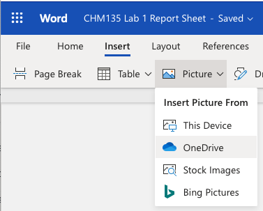
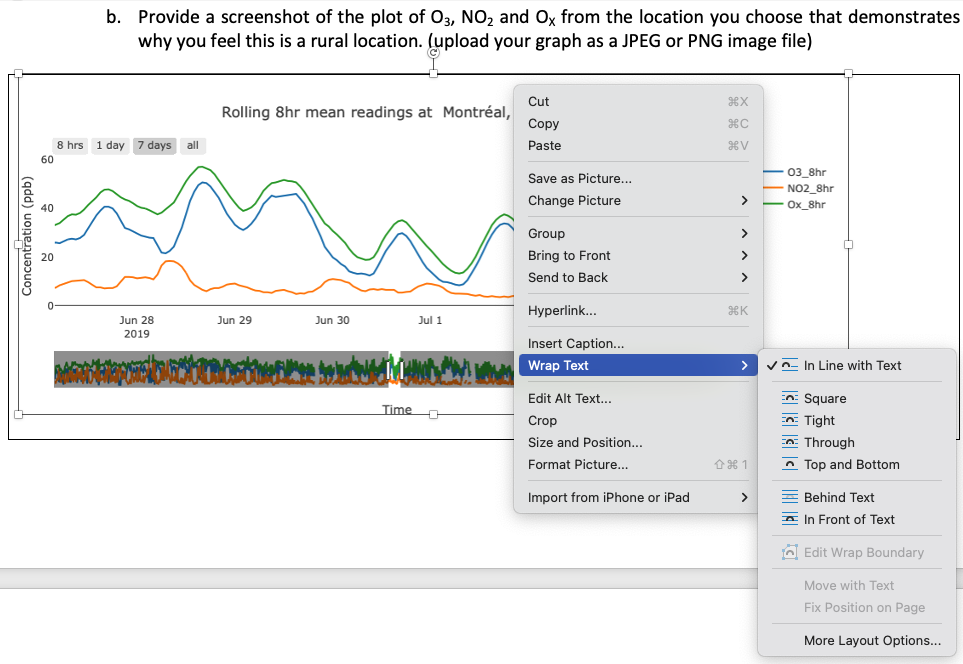

# Getting Setup for Success {#capabilities}

Like many things in life, putting in some organizational work at the start will pay off in increased efficiency later. In this section we will talk briefly about how to access the Excel and Word, which will be needed for CHM135 lab and university courses more generally.  We will also address best practices in file management to ensure you can quickly and easily find the files you have been working on. Finally, we will talk about some of the practicalities of making the CHM135 lab reports, such as uploading images into a word document and creating a PDF. All of these are useful tools you will use throughout your university career and beyond.

## Accessing the Microsoft Office Suite of Software

First and foremost, you must have a working copy of both Microsoft Excel and Word. **Current U of T students with a UTmail+ account can access this software for free**, see the [Microsoft 365 ProPlus](https://onesearch.library.utoronto.ca/ic-faq-categories/office-365-proplus) site for details. On this site you will see several access options, one is the typical desktop version of the software (for Windows or Mac) where it is downloaded and run on your local computer.  The software can also be loaded onto an Android or iOS device. The software can also be used in a web browser. **The web version of the software can be accessed via your UTmail+ account** at https://mail.utoronto.ca, which will send you to the Microsoft Outlook web interface where you can find the available apps on the lefthand menu or by clicking on the app launcher (the 9 dots on the top left).

<center>
```{r}
knitr::include_graphics(path="./gifs/AppOnline.gif")
```
</center>

There is no right or wrong way to access Excel and Word. Most likely, you will want to access your work in different ways depending on your situation. For example, you might want to use the desktop software on your personal computer and the web interface when on a shared computer on campus. Accessing your files readily depends a lot on good file management, which is discussed in the next section.

## Managing your Files

In addition to the Microsoft Office software suite, current U of T students have access to OneDrive (top right app in the gif above) which is an online file management system. **We strongly suggest you use OneDrive to store and organize your files**. Instructions on how to access and navigate the online OneDrive interface can be found [here](https://uthrprod.service-now.com/infocomm?id=kb_article&sys_id=397eb257dba0d0105030735a8c9619d7).  If you have a personal computer or laptop, syncing OneDrive with that computer is a great option as your files are available on your personal computer for offline work and also backed up and available online. Instructions on how to sync OneDrive with a personal computer can be found [here](https://uthrprod.service-now.com/infocomm?id=kb_article&sys_id=786db1a5db36b05094a03342399619db).

When saving your work, organization is important so you can easily find files you have been working on. Here is an example for CHM135 where a folder for CHM135 has been created on OneDrive (and synced with a Mac laptop in this case). To further organize the content, subfolders have been created for the class, tutorial, and lab components of the class, and subfolders within the lab for each of the five experiments. 

<center>
 
</center>

Folders can be created in any operating system (Mac or Windows) by right clicking on a blank space in the location where you would like the folder to be placed (FILE EXPLORER for Windows or FINDER for Mac) and selecting NEW FOLDER (Mac) or NEW then FOLDER (Windows). Folder names can be edited by left clicking on the folder to select it and then left clicking again (not a quick double click) to indicate you want to edit the name and then hitting ENTER once you are done editing. 

```{r}
knitr::include_graphics(path="./gifs/FileOrganization.gif")
```

The folders in the gif above were created in a directory that is linked between a Mac laptop and the OneDrive App and so there are a few special options available. What do these options do?

- **Always Keep on This Device**: This relates to your ability to work on this content offline. If you click on this option the folder or file will be downloaded onto your computer and available offline. 

- **Free Up Space**: Basically the opposite of *Always Keep on This Device*, it indicates to OneDrive that this folder or file is not needed for offline work and can be stored online only. This option is useful for shared computers as well as laptops with limited storage. However, it is important to understand that internet access is required to access these files.  

- **Share**: This will produce a link that can be shared with others to work on a file or folder together. You will need to specify who can view the content, addition details on file sharing through OneDrive can be found [here](https://onesearch.library.utoronto.ca/ic-faq/37309).

- **Version History**: This is only available for files, not folders, and relates to the auto-save function in all Microsoft software. If something goes seriously wrong with a file you could look at the version history and revert to a version before the issue arose.

- **View Online**: This will open the folder or file on the online OneDrive interface in a web browser. 

These same options are available on a Windows computer, details on how to access them are outlined on this [OneDrive for Windows 10](https://support.microsoft.com/en-us/office/save-disk-space-with-onedrive-files-on-demand-for-windows-10-0e6860d3-d9f3-4971-b321-7092438fb38e) Microsoft Support page. In addition to choosing whether to download each folder or file individually, OneDrive can be configured with either the *Always Keep on This Device* or *Free Up Space* as the default setting. Details on how to configure this on a Windows computer are included on the same [OneDrive for Windows 10](https://support.microsoft.com/en-us/office/save-disk-space-with-onedrive-files-on-demand-for-windows-10-0e6860d3-d9f3-4971-b321-7092438fb38e) Microsoft Support page linked above and for Macs on the [OneDrive for Mac](https://support.microsoft.com/en-us/office/save-disk-space-with-onedrive-files-on-demand-for-mac-529f6d53-e572-4922-a585-e7a318c135f0) Microsoft Support page.

## Creating Professional Documents

Using Microsoft Word to produce professional documents with images, and then creating a PDF output is a valuable skill for university courses and future careers.  Often graphs or other data visualizations from Excel, are added to Word documents, so let’s start there.

### Adding an Excel Graph to a Word Document

**Excel graphs can be added to Word documents using the copy and paste function**. This is as simple as copying the Excel graph using the COPY function from the dropdown menu that appears when you right click on the plot or using the keyboard shortcut (CONTROL+C for Windows and COMMAND+C for Mac). The graph can be added to the Word document using the PASTE function from the right-click dropdown menu or the keyboard shortcut (CONTROL+V for Windows and COMMAND+V for Mac). 

```{r}
knitr::include_graphics(path="./gifs/GraphOnline.gif")
```

If this series of steps are carried out in the web interface (as shown in the gif above) the Excel graph will be added as an image. However, if the desktop versions of the software are used the Excel graph will retain the ability to the manipulated and edited using the CHART DESIGN tab that will appear in the Word ribbon if you click on the plot. Double clicking on the parts of the graph will also bring up relevant formatting windows. This pasted graph is still connected to the original Excel file, something that is apparent if you click the EDIT DATA IN EXCEL function in the CHART DESIGN ribbon. Changes made to the plot in Excel will be updated in the word document. However, if the original Excel file is deleted, moved, or its name is changed, this connection is lost and an error will appear if the EDIT DATA IN EXCEL function is selected.

```{r}
knitr::include_graphics(path="./gifs/GraphOffline.gif")
```

In the gif above, when the Excel graph is copied, the cursor hovers briefly over the SAVE AS PICTURE option in the dropdown menu before moving to COPY. If SAVE AS PICTURE is selected the graph can be saved in a variety of common image file types (e.g PNG or JPEG). This can be useful if adding the graph to non-Microsoft software or if you would like to preserve its formatting.

### Adding Images to a Word Document

There are many reasons you might want to add saved images to a Word document. For the CHM135 lab reports there are questions that ask you to upload plots saved from the [CHM135: Exploring Air Quality Data App](https://davidrosshall.shinyapps.io/AirQualityApp/) and, on some reports, opportunities to show your work by taking a picture of your worked solution. In all cases, you should begin by saving the image file in a typical format (e.g. PNG or JPEG) in a known location on your computer or OneDrive. The image can be added by selecting the PICTURES option on the INSERT ribbon, then PICTURE FROM FILE, and the relevant image file located. 

```{r}
knitr::include_graphics(path="./gifs/WordImage.gif")
```

On the web interface the PICTURE option will prompt you to add the image from THIS DEVICE (your current computer) or OneDrive. If the files on your computer are synced with OneDrive both options will allow you to access the saved image file.

<center>
 
</center>

Once an image has been added to a word document you can alter its size and alignment. You can also change how the text interacts with, or wraps around, the image. Right clicking on the image and selecting WRAP TEXT will show the available options. 

<center>
 
</center>

### Creating a PDF from a Word Document

Once you are done creating your word document the best way to disseminate it is to transform it into a PDF so the formatting or other aspects of the document remain intact. On the desktop version of Word you can create a PDF using SAVE AS or SAVE A COPY in the FILE menu then select PDF from the FILE FORMAT dropdown menu. To create a PDF from the online version of Word choose FILE then SAVE AS then DOWNLOAD AS PDF.

```{r}
knitr::include_graphics(path="./gifs/PDFCreate.gif")
```