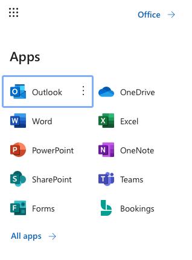
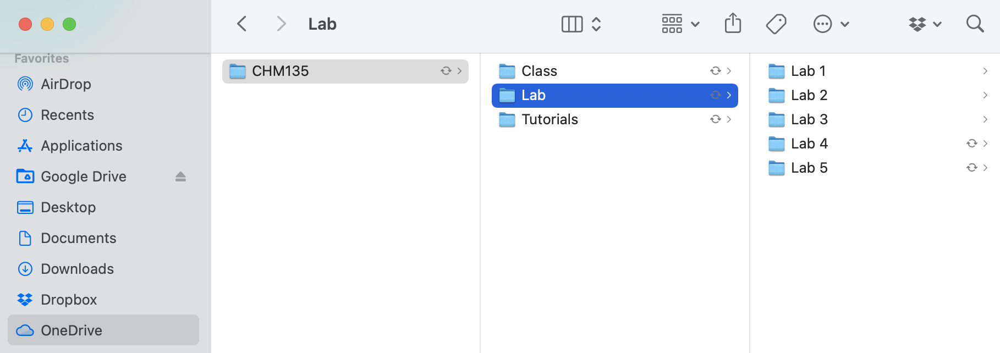

# Getting Setup for Success {#capabilities}

Like many things in life, putting in some organizational work at the start will pay off in increased efficiency later on. In this section we will talk briefly about how to access the software you need to complete the first year labs and university courses more generally.  We will also address best practices in file management so you can work efficiently and be sure you can quickly and easily find the files you have been working on. Finally we will talk about some of the practicalities of making the CHM135 lab reports, such as uploading images into a word document and creating a PDF. Again, these are useful tools you will use throughout your university career and beyond.

## Accessing the Microsoft Office Suite of Software

First and foremost, you must have a working copy of both Microsoft Excel and Word. Current U of T students with a UTmail+ account can access this software for free, see this U of T libraries website for details: https://onesearch.library.utoronto.ca/ic-faq-categories/office-365-proplus. On this site you will see two access options, one is the typical desktop version where the software is downloaded and run on your local computer.  This is the typical way to run this software and until recently was the only way.  The second way to access this software is via the web interface where the software runs in a web browser. The web version of the software can be accessed via your UTmail+ account at mail.utoronto.ca, which will send you to the Microsoft Outlook web interface where you can find all the available apps by clicking on the app launcher (the 9 dots on the top left).

 

There is no right or wrong way to access Microsoft Excel and Word in this experiment, in fact it might make sense to access your work in different ways depending on your situation. Maybe you use the desktop software on your personal computer and the web interface when on a shared computer on campus. How you access your files depends a lot on where they are saved, something that will be discussed in the next section.

## Managing your Files

In addition to the Microsoft Office software suite, current U of T students have access to OneDrive (top right app in Figure 1) which is an online file management system. We strongly suggest you use OneDrive to store and organize your files. Details on how to access OneDrive using the web interface, as well as how to sync OneDrive with your personal computer can be found here: https://onesearch.library.utoronto.ca/ic-faq-categories/onedrive. If you have a personal computer or laptop, syncing OneDrive with that computer is a great option as your files are available on your personal computer for offline work and are also always backed up and available online.

Once you decide where you would like to save your work, it is important to organize this space so you can easily find files you have been working on. Here is an example for CHM135 where a folder for CHM135 has been created on OneDrive (and synced with a Mac laptop in this case). To further organize the content subfolders have been created for the class, tutorial, and lab components of the class and subfolders within the lab for each of the five experiments.

## Creating Professional Documents

Word processing is an important aspect of university education and there will come a time when you will need to produce professional documents in Microsoft Word that include images and are output as a PDF. As you are reading this resource about data analysis in Excel, it is likely that a graph or other data visualization from Excel is one of the images you would need to add to your word document, so let's start there.

### Adding an Excel Graph into a Word Document

One way to add a graph in Excel to a document in Word is to simply copy and paste it. An interesting aspect of this approach is that the Excel graph is not an image file, but is still connected to the Excel file it came from and can be further manipulated and altered, as shown in the gif below. There is nothing wrong with this and if you have careful file management (meaning the Excel file doesn't get moved or deleted or have its name changed) it works well. However, if you would like the content of the Word document not to be connected to the Excel file you can add the graph as an image.

gif - copy and paste excel graph into word and click on aspects of the graph to show that it can still be editted

The first step to adding an Excel graph as an image to a Word document is to the save the graph as an image. To do this select the graph with your cursor, right click and select *Save as Image*. Then you can save your graph in an appropriate location with an appropriate title.  

gif - save Excel graph to the 135 lab 1 folder with an appropriate name

Now that you have a created an image of your graph you can add it anywhere you would like in your Word document. Simply place your cursor wherever you would like to add the image in the document and on the *Insert* menu select *Pictures* > *Pictures from File*. Once the image is in your document you can alter its size and alignment. You can also change how the text interacts with the image, meaning is it in line with the text (in line), does the text go around on the side of the image (square), or is the image simply in front or behind the text (in front / behind).

gif - add image to a word document, change its size, alignment and interaction with text

### Creating a PDF from a Word Document

Once you are done creating your word document the best way to disseminate it is to transform it into a PDF so the formatting or other aspects of the document remain intact. On the desktop version of Word you can create a PDF using the *Save a Copy...* function in the *file* menu.  

gif - save as PDF on desktop

To create a PDF from the mobile version of Word choose *file* then *Save as* then *Download as PDF*.

gif - save as PDF on mobile