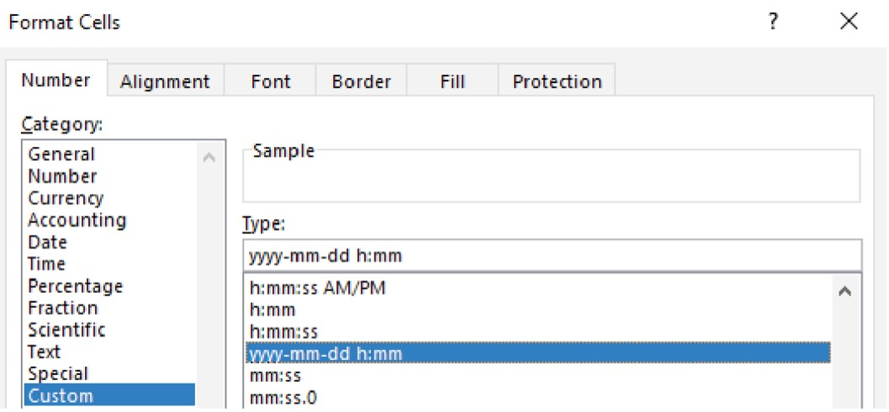

# File Upload and Data Formatting and Organization

This guide is written for the first-year chemistry courses at the University of Toronto but would be useful for a variety of applications in academia and beyond. 

## Opening a CSV File

Many datasets (particularly larger ones) are stored as .csv files. The CSV file extension stands for comma-separate values file, a popular file format for storing data that you are bound to encounter again in your academic careers. As the name implies, CSV files contain data separated by commas; go ahead and open your file in Notepad/TextEdit or Microsoft Word if you want to see this.  Excel can open CSV files and will often automatically assigned the comma-separated values into different columns.  Once you open your .csv file using excel be sure to save it as an .xlsx file so that you can avail yourself of all of Excel’s features.

gif - saving file with .xlsx extension

## Data Organization and Cell Formatting 

Once you have a dataset open, look at it and notice how the numbers are arrayed in a table of cells, each containing a single value. These cells are arranged in columns with labelled headings (A, B, C, etc.) and rows (1, 2, 3, etc.). A single cell can be referenced using this system (i.e. in the image above the cell “B3” contains the value 19.7). 

Excel displays pound signs (###) if a cell is too narrow to display the value. You can manually adjust the width of columns by dragging the boundary on the right side of the column heading or double clicking the right boundary to automatically adjust it to the width of its contents.

If any of your cells are not properly formatted, right click on them and select *Format Cells...* from the dropdown menu (you can also go to the *Format* menu and select *Cells...*). In the *Format Cells* dialog box (Figure 2) you can see many formatting options, some of which are described in Table 1. If your dataset includes a date you can format it so that it shows both the date and the time using the *Custom* category and the yyyy-mm-dd h:mm formatting option as shown in Figure 3. 

Some useful number formats are provided in Table 1. If your data includes a date and time component it is important to note that Excel stores date values as the number of days since 1900-Jan-0, with a decimal value corresponding to the time of day. In the example in Table 1, 44005 days have passed since then, so Excel can interpret this as a date value. This also goes the other way when your numerical value may incorrectly be interpreted as a date. Just remember that the formatting only affects how the numbers are displayed, not the numbers themselves. 

Need to add Table 1
