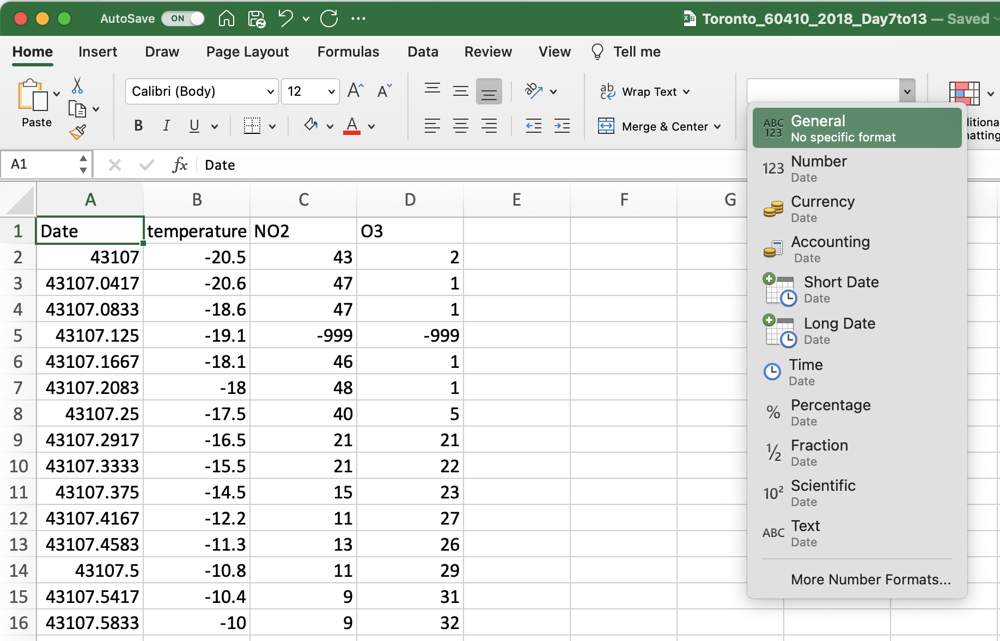
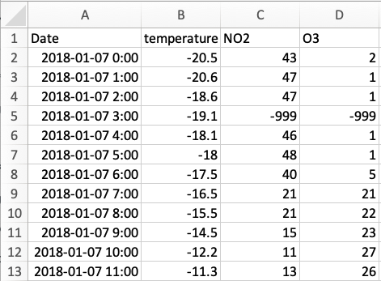

# Data Wrangling

This guide is written for the first-year chemistry courses at the University of Toronto but we hope you will find it useful for a variety of courses and even applications outside of academia. 

Performing experiments in the lab often involves the production and collection of data. You might feel that any changes, or manipulations, to the data would be dishonest. However, the truth is **most data requires some manipulation as part of its analysis**. In this section we will discuss how to import your data into Excel (if it's not already in Excel), how to format it and how to make educated decisions about how to structure and clean your data before you begin your analysis.

This section uses the air quality datasets from the NAPS network as an example. If you received a dataset through your CHM135 lab section feel free to use it to follow along. If not, you can visit the [Introduction] page to download the example dataset used throughout this resource (note that you cannot use the example dataset for your analysis in CHM135). 

## Opening a CSV file

Many datasets (particularly larger ones) are stored with the ".csv" file extension. The CSV file extension stands for comma-separate values, a popular file format for storing data that you are bound to encounter again in your academic career. As the name implies, CSV files contain data separated by commas. If you're interested, feel free to open your file in Notepad, TextEdit or Microsoft Word to see this organization.  Excel can open CSV files and will typically automatically assign the comma-separated values into different columns.  **Once you open your CSV file using Excel, save it as an .xlsx file so that you can use all of Excel’s features**. It is also best practice to **keep a copy of the CSV file saved to your computer separate from the .xlsx file you will use for your analysis** just in case something goes wrong and you need to start from scratch with a clean dataset.

```{r}
knitr::include_graphics(path="./gifs/CSVsaveas.gif")
```

When you open the NAPS data (or any file) in Excel notice how the values are arrayed in a table of cells, each containing a single value. These cells are arranged in columns labelled by a letter (A, B, C, etc.) and rows labelled using a number (1, 2, 3, etc.). A single cell can be referenced using this system (i.e. in the gif above the cell “B3” contains the value "-20.6").

## Data Discovery and Cell Formatting

Whenever you create a new spreadsheet and start interacting with numbers **it is important to understand the meaning of the numbers on the page, including details such as relevant units**. The data from the NAPS network is organized into four columns with the following headers that communicate what the numbers in each column represent. Here are some additional details:

- **Date**: Indicates the day and time the air quality data was measured.
- **temperature**: The ambient air temperature in degrees Celsius.
- **NO2**: The concentration of NO~2~ in the air in ppb.
- **O3**: The concentration of O~3~ in the air in ppb.

When collecting data in the lab (light absorbance, pH, temperature...) the values you collect are typically snapshots of the system you're studying at that moment. The NAPS data is slightly different. The reported values (temperature and concentration) are hour-ending averages, meaning that when you see temperature or concentration for 1 AM, it is the average of the measured values between 12 AM and 1 AM that day. 

**Each cell in an Excel spreadsheet is assigned a formatting type that is displayed in the dialog box on the HOME ribbon**. The default setting in Excel is typically GENERAL which means that Excel will use the contents of the cell to judge whether it contains text, or a number, or a equation (more details on that in the [Math, Stats and Programming] section), or a date (more on that below), etc. Although all the cells in the example here are formatted using the GENERAL label you might notice that the text in the column headers are all left justified and the numbers are right justified. This is the default formatting in Excel for these data types and it is done purposefully so you can quickly evaluate whether Excel has properly assessed the contents of the cell.

<center>

</center>

There is no need to change the cell formatting for the ***Temperature*** or ***NO~2~*** and ***O~3~*** concentration data (although feel free to play around), but **it is likely that the data in the *Date* column is not formatted properly and is instead written as a series of numbers**. This issue arises because the date and time of the measurement is communicated to Excel as the number of days since 1900-Jan-0, with a decimal value corresponding to the time of day. Some formatting options in Excel for dates and times are provided in the table below. In the example in this table, 44005 days have passed since 1900-Jan-0, and Excel interprets this as midnight on July 23, 2020. For the NAPS dataset, Excel often misinterprets what is meant to be displayed as a date and time as a number, but this misunderstanding can also go the other way and a numerical value can be incorrectly interpreted as a date. Just remember that the formatting only affects how the numbers are displayed, not the numbers themselves, so the numbers in the *Date* column are correct you just need to change the formatting so that they are displayed in a way that is meaningful to us as the consumer of this data.

|       Category      |     Description                                                                                                            |             Example           |   |   |
|:-------------------:|----------------------------------------------------------------------------------------------------------------------------|:-----------------------------:|---|---|
|        General      |     Has no specific   format and so for numbers returns the full numerical value                                           |              44005            |   |   |
|        Number       |     General display of   numbers, can adjust the number of decimal places                                                  |            44005.00           |   |   |
|      Scientific     |     Displays numbers   using scientific notations, can adjust the number of decimal places                                 |            4.40E+04           |   |   |
|     Date (long)     |     A date format that   gives day, month, year in full written notation                                                   |     Tuesday, June 23, 2020    |   |   |
|     Date (short)    |     A date format that   gives day, month, year in condensed notation                                                      |           2020-06-23          |   |   |
|        Custom       |     A date format that   gives day, month, year as well as time of day that is useful for our needs in   Experiment 1.     |         2020-06-23 0:00       |   |   |


To change the formatting of the *Date* column first select the entire column by clicking on the column header ("A"), then right click and select FORMAT CELLS from the dropdown menu. If you're using the online version of Excel you will select NUMBER FORMAT from the dropdown menu and it will open the NUMBER FORMAT dialog box that includes the relevant formatting options. You can also go to the FORMAT menu and select CELLS or select MORE NUMBER FORMATS from the dropdown menu on the HOME ribbon (so many choices!).  

In the FORMAT CELLS (or NUMBER FORMAT) dialog box there are many formatting options, some of which are described in the table above. There is no right or wrong way to format the date and time values, but given **the NAPS dataset includes both date and time** a useful formatting option is the yyyy-mm-dd h:mm option, which displays both date and time in the same cell. This option is not (for some strange reason) available in the DATE category of the FORMAT CELLS dialog box, but instead in the CUSTOM category as shown in the gif below. 

```{r}
knitr::include_graphics(path="./gifs/Cellformatting.gif")
```


## Data Cleaning 

*Cleaning* data refers to the process of creating useful and meaningful datasets from which useful and meaningful information can be obtained. In the first-year chemistry lab the process of data cleaning typically involves removing data points that are not useful to the analysis or are below a defined detection limit for the instrumentation in question. At first glance the idea of removing data points might seem suspect and make you worried about academic honest. The key to addressing this concern is that **any changes to the data need to be transparent and reproducible**, meaning the workflow (e.g. the steps you followed) used to clean the data should be included with the data itself when reporting the results of the analysis and the steps in the workflow should be reproducible such that someone else could adjust their data in the same way. 

To explore exactly what this means, let's take a look at the NAPS dataset. Simply looking at the first few rows of the example NAPS data, something pops right out away: **the -999 concentration values for both NO~2~ and O~3~ at 3 AM on January 7, 2018 in cells C5 and D5. What happened there?**

<center>

</center>

If a timeseries is created by plotting the concentration of NO~2~ and O~3~ versus time from this data (note that plotting your data here isn't necessary, but if you would like to, detailed instructions are provided in the [Data Visualization] section) you would notice there are actually three timepoints that include data with a concentration around -1000 ppb. These concentration values are obviously physically impossible **What is happening?** 

<center>

</center>

These -999 concentration values are present in the dataset because they are reported by the NAPS system whenever there is any doubt in relation to a measurement taken by one of the instruments. **A value of -999 was used purposefully in this role as it is immediately noticeable in the dataset and therefore easy to remove**.  In addition, unlike reporting a missing value, -999 cannot be misinterpreted as zero.

Here is our first foray into data cleaning. **How do we remove -999 values?** Do we need to go through all 168 concentration values for each pollutant to find these outliers? Of course not! This is where we start to explore the functions and operations built into the spreadsheet software to do this work for us! 

The FIND function in Excel is a great way to look for these -999 values. This function can be found by selecting EDIT then FIND and FIND  in the top pulldown menu, or the FIND AND SELECT magnifying glass followed by FIND in the EDITING menu on the HOME ribbon. On the desktop version of Excel you can also use the search bar at the top right of your Excel window (magnifying glass on a Mac and black box on Windows). **No matter how you access the FIND function, type -999, hit ENTER, and see what happens.**

```{r}
knitr::include_graphics(path="./gifs/Find.gif")
```

**If you find any -999 values you will need to delete the entire row within your dataset** If you simply delete the -999 value in the cell, Excel to treat it as a zero for any subsequent mathematical manipulations. Given the concentration was not measured at this time, inadvertently changing the concentration to a value of zero would unintentionally alter the dataset. To delete a row, select it by clicking on the row number on the left then right click and select DELETE from the dropdown menu that appears. Note that simply hitting DELETE on your keyboard will delete the values in the row but not the row itself.

```{r}
knitr::include_graphics(path="./gifs/FindReplace.gif")
```

**A couple of practical notes about using the FIND function.** It is important that no cells within the sheet are selected, if cells are selected Excel will only search the selected cells. As the rows are deleted the graph updates automatically. This is useful when formatting the axes of your graph as the format of these values will follow the format in the selected cells (more details on this in the [Data Visualization] chapter).

This the extent of data cleaning required for the NAPS dataset. Now that you have completed your first data cleaning workflow, reflect on how this process could be communicated in a way that is both transparent and reproducible. **How would you explain it?**

Data cleaning workflows will be incorporated into the first year chemistry labs whenever appropriate. Something to note before we leave this topic is the utility of visualizing your data when thinking about how to approach an analysis. The timeseries graph shown in the figure above is not pretty, the axes aren't yet labelled, it doesn't have an appropriate title, but it was useful as a first step in this analysis as it quickly and easily allowed us a snapshot of what was happening.
