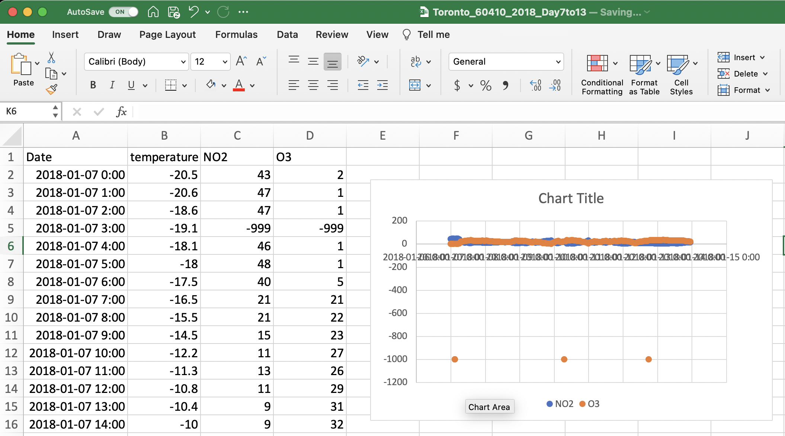

# Data Wrangling

This guide is written for the first-year chemistry courses at the University of Toronto but we hope you will find it useful for a variety of courses and even applications outside of academia. 

Performing experiments in the lab often involves the production and collection of data. You might feel that any changes, or manipulations, to the data would be dishonest. However, the truth is **most data requires some manipulation as part of its analysis**. In this section we will discuss how to import your data into Excel (if it's not already in Excel), how to format it and how to make educated, and transparent, decisions related to data manipulation. 

## File Upload

Many datasets (particularly larger ones) are stored as .csv files. The CSV file extension stands for comma-separate values file, a popular file format for storing data that you are bound to encounter again in your academic career. As the name implies, CSV files contain data separated by commas. If you are interested, feel free to open your file in Notepad, TextEdit or Microsoft Word to see this organization.  Excel can open CSV files and will typically automatically assign the comma-separated values into different columns.  **Once you open your .csv file using Excel, save it as an .xlsx file so that you can use all of Excel’s features**. It is also best practice to **keep a copy of the .csv file saved to your computer separate from the .xlsx file you will use for your analysis** just in case something goes wrong and you need to start from scratch with a clean dataset.

```{r}
knitr::include_graphics(path="./gifs/CSVsaveas.gif")
```

## Data Organization and Cell Formatting 

When you open a file in Excel notice how the values are arrayed in a table of cells, each containing a single value. These cells are arranged in columns with labelled headings (A, B, C, etc.) and rows (1, 2, 3, etc.). A single cell can be referenced using this system (i.e. in the gif above the cell “B3” contains the value "-20.6"). 

When you open the CSV file from the NAPS program you will see the data organized into four columns with the following headers:

- **Date**: This column indicates the day and time the air quality data was measured.
- **temperature**: The ambient air temperature in degrees Celsius.
- **NO2**: The concentration of NO~2~ in the air in ppb.
- **O3**: The concentration of O~3~ in the air in ppb.

The temperature and concentration values provided are hour-ending averages, meaning that when you see temperature or concentration for 1 AM, it is the average of the measured values between 12 AM and 1 AM that day. 

If any of your cells are not properly formatted, select these cells, then right click and select FORMAT CELLS from the dropdown menu (you can also go to the FORMAT menu and select CELLS). In the FORMAT CELLS dialog box there are many formatting options, some of which are described in the table below. If you are using the online version of Excel you will select NUMBER FORMAT from the dropdown menu and it will open the NUMBER FORMAT dialog box that includes the relevant formatting options. There is no absolute right and wrong way to format your data, but given **the NAPS dataset includes both dates and times you can format it so that it shows both the date and time using the CUSTOM category and the yyyy-mm-dd h:mm formatting option as shown below**. 

```{r}
knitr::include_graphics(path="./gifs/Cellformatting.gif")
```

You might have noticed that the date values in the gif above was initially written as a series of numbers, that is because Excel stores date values as the number of days since 1900-Jan-0, with a decimal value corresponding to the time of day. In the table below, 44005 days have passed since then, so Excel can interpret this as a date value. This relationship between numbers and dates can also go the other way when your numerical value may incorrectly be interpreted as a date. Just remember that the formatting only affects how the numbers are displayed, not the numbers themselves. 

|       Category      |     Description                                                                                                            |             Example           |   |   |
|:-------------------:|----------------------------------------------------------------------------------------------------------------------------|:-----------------------------:|---|---|
|        General      |     Has no specific   format and so for numbers returns the full numerical value                                           |              44005            |   |   |
|        Number       |     General display of   numbers, can adjust the number of decimal places                                                  |            44005.00           |   |   |
|      Scientific     |     Displays numbers   using scientific notations, can adjust the number of decimal places                                 |            4.40E+04           |   |   |
|     Date (long)     |     A date format that   gives day, month, year in full written notation                                                   |     Tuesday, June 23, 2020    |   |   |
|     Date (short)    |     A date format that   gives day, month, year in condensed notation                                                      |           2020-06-23          |   |   |
|        Custom       |     A date format that   gives day, month, year as well as time of day that is useful for our needs in   Experiment 1.     |         2020-06-23 0:00       |   |   |

## Data Manipulation 

The word *manipulation* has a sinister connotation when referring to people. In terms of data, manipulation is the process of creating useful and meaningful datasets from which useful and meaningful information can be obtained. An example *what* and *why* of data manipulation can be found in the NAPS air quality datasets.

If you were to create a timeseries for your NAPS data you may see something similar to the plot shown below (note that plotting your data here isn't necessary, but if you would like to, detailed instructions are provided in the [Data Visualization] section). 
<center>

</center>

**Does anything stand out about this plot? Are there any outliers or points that differ significantly from the others?** In this timeseries there are three points that are immediately suspicious. The y-axis represents the concentration of either O~3~ or NO~2~, and three points have reported concentrations of about –1000 ppb, a physical impossibility. **What is happening?** 

Anytime there is any doubt in relation to a measurement taken by one of the instruments the system in programmed to report a value of -999. The use of -999 was done purposefully as it is immediately noticeable in the dataset and therefore easy to remove.  In addition, unlike reporting a missing value, -999 cannot be misinterpreted as zero.

Here is our first foray into data manipulation. **How do we remove -999 values?** Do we need to go through all 168 concentration values for each pollutant to find these outliers? Of course not! This is where we start to explore the functions and operations built into the spreadsheet software to do this work for us! 

The FIND function in Excel is a great way to look for these -999 values. This function can be found by selecting EDIT then FIND and FIND...  in the top pulldown menu, or the FIND AND SELECT magnifying glass followed by FIND... in the EDITING menu on the HOME ribbon. On the desktop version of Excel you can also use the search bar at the top right of your Excel window (magnifying glass on a Mac and black box on Windows). **No matter how you access the FIND function, type -999, hit ENTER, and see what happens.**

```{r}
knitr::include_graphics(path="./gifs/Find.gif")
```

**If you find any -999 values you will need to delete the entire row within your dataset** If you simply delete the -999 value in the cell, Excel to treat it as a zero for any subsequent mathematical manipulations. Given the concentration was not measured at this time, inadvertently changing the concentration to a value of zero would unintentionally alter the dataset. To delete a row, select it by clicking on the row number on the left then right click and select DELETE from the dropdown menu that appears. Note that simply hitting DELETE on your keyboard will delete the values in the row but not the row itself.

```{r}
knitr::include_graphics(path="./gifs/FindReplace.gif")
```

Take a minute to notice a few things in the gif above. When searching for the -999 values using the FIND function it is important that no cells within the sheet are selected, if cells are selected Excel will only search the selected cells. Also notice that as the rows are deleted the plot updates automatically. This is useful when cleaning up the data, as in this example, but also when formatting the axes of your graph as the format of these values will follow the format in the selected cells (more details on this in the [Data Visualization] chapter).

This the extent of data manipulation required for the air quality dataset used here, but the idea of preparing our data for analysis is something we will return to throughout the first year chemistry labs and is something to reflect on as you complete any analysis. One thing to note before we leave this topic is the utility of visualizing your data when thinking about how to approach an analysis. The graph shown in the figure above is not pretty, the axes aren't yet labelled, it doesn't have an appropriate title, but it was useful as a first step in this analysis as it quickly and easily allowed us a snapshot of what was happening. 
