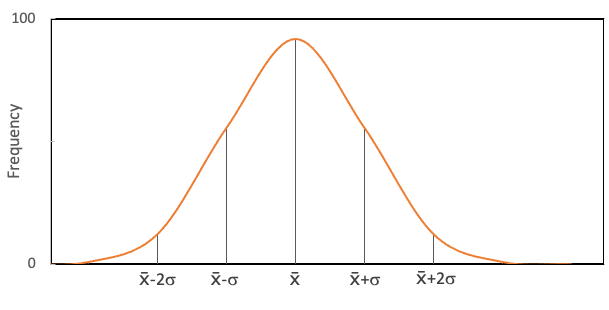
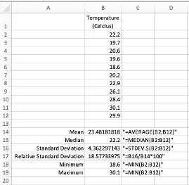
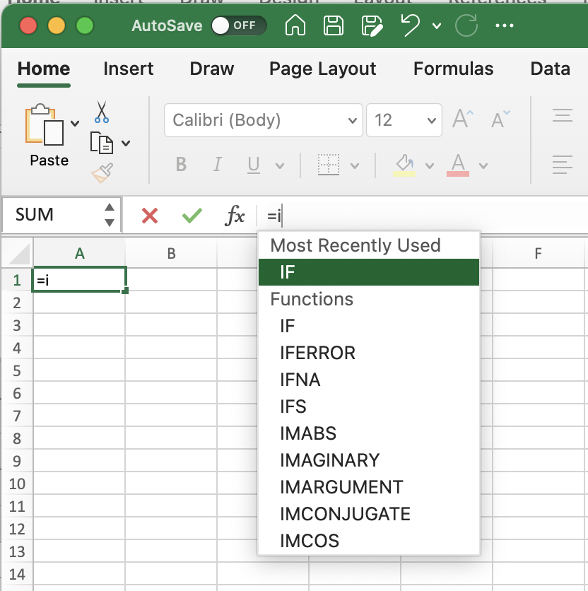
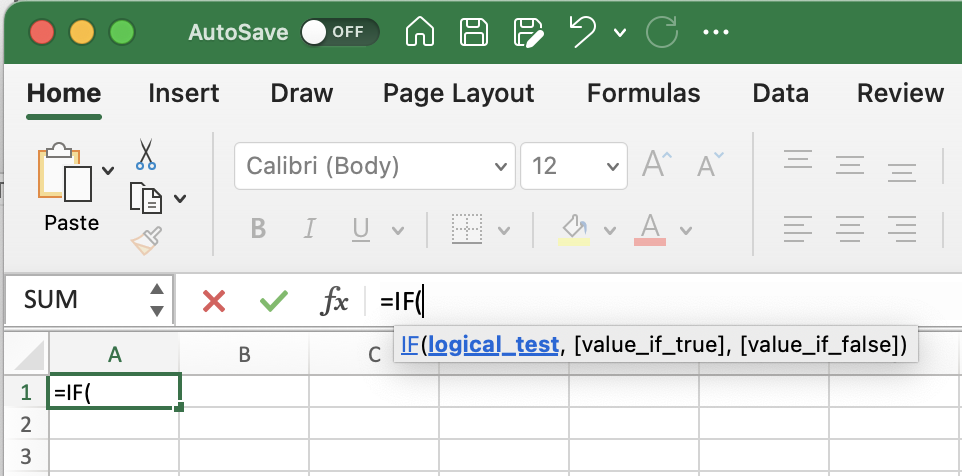

# Math, Stats, and Programming

Physical chemistry is a quantitative science, meaning we use mathematical operations to explain and explore chemical phenomena. This math can be done by hand, but once you have more than one or two data points this gets very tiring and a spreadsheet can be a lifesaver! In this section we will talk about how to program mathematical equations into Excel, how to use common mathematical and statistical functions, and how to reference other values within the spreadsheet. We will also dip our toes into some simple computer programming that can be very useful.

## Mathematical Operations

Excel can perform many mathematical operations and the table below provides a list of some of the most common with their corresponding formula. 

|     Input               |     Operator                                                 |     Example…        |     … solves to    |   |
|-------------------------|--------------------------------------------------------------|---------------------|--------------------|---|
|     =                   |     Equal sign indicates a mathematical operation            |                     |                    |   |
|     +                   |     Addition                                                 |     =2+2            |     4              |   |
|     -                   |     Subtraction                                              |     =3–2            |     1              |   |
|     *                   |     Multiplication                                           |      =3*2           |     6              |   |
|     /                   |     Division                                                 |     =4/2            |     2              |   |
|     ^                   |     Exponent                                                 |     =4^2            |     16             |   |
|     ( )                 |     Brackets to indicate order of operations                 |     =(4+2)*2        |     12             |   |
|     LOG(number,base)    |     Logarithm (10 is the default if no base is indicated)    |     =LOG(100,10)    |     2              |   |
|     LN(number)          |     Natural Logarithm                                        |     =LN(2)          |     0.693…         |   |

Recall chemical equations (\ref{eq1}) to (\ref{eq3}) from the [Introduction] that describe the relationship between NO~2~ and O~3~.

$$
\begin{align}
    NO_2 + h\nu → NO + O && \label{eq1}\tag{1} \\
O + O_2 →  O_3 &&  \label{eq2}\tag{2}  \\
    O_3 + NO →  O_2 + NO_2 &&  \label{eq3}\tag{3}
\end{align}
$$
Also, recall that because these two pollutants are so intimately linked atmospheric chemists have defined a term called “odd oxygen” or O~X~ that is the sum of NO~2~ and O~3~ at a given time point.

$$
\begin{align}
    [O_3] + [NO_2] &= [O_X] \label{eq4}\tag{4} 
\end{align}
$$

To add O~X~ to your analysis you will need to calculate the concentration O~X~ at each timepoint in your dataset. You can do this by simply adding the cells containing O~3~ and NO~2~ (both concentrations are in ppb so they can be added directly) for the first timepoint then copy this formula down the column. When you add a formula into Excel remember to start with a "=" sign (this will let Excel know you are writing a formula), if you are referencing a cell you can either write it in (e.g. "C2") or you can click on the cell. Once your formula is complete, hit ENTER and Excel will perform the calculation.

To copy the formula from one cell down the list of data points, you can use the copy and paste function in the edit menu or the keyboard shortcuts, CONTROL+C to copy and CONTROL+V to paste (COMMAND+C and COMMAND+V on a Mac). You can also use a shortcut specific to Excel. Click on the cell with your formula and notice the little square in the lower righthand corner.  Click on this square and drag the formula down the column, or, even better, double click on the square and Excel will automatically paste the formula down the column until the end of the series (note that it will stop at the first blank cell so if you are missing values you may need to copy and paste the formula the rest of the way). When you add a new value, make sure you remember to label your column.

```{r}
knitr::include_graphics(path="./gifs/OxCalc.gif")
```

If you are learning about mathematical operations in Excel for the first time we strongly suggest reading the next section on cell referencing.


## Cell Referencing

One of Excel’s strengths is its ability to easily perform mathematical operations in larger datasets. To take advantage of this feature it is important to appreciate how Excel references values in the spreadsheet. Simply referencing a cell in Excel will add a **relative reference**, which means that the reference will move as the equation is copied and pasted to other cells.  This is the type of reference created in the O~X~ calculation in the section above. If you are unsure of the cells being referenced in an equation Excel will visualize the reference when you click on the cell. To exit the function hit ESC.

```{r}
knitr::include_graphics(path="./gifs/RelRef.gif")
```

A relative reference is very useful when calculating a series of numbers, like O~X~ from O~3~ and NO~2~, however there are times when you might wish to make an **absolute reference**, such that it does not move as it is copied and pasted. To do this you add a $ in front of the letter and/or the number in the cell reference.  It is possible to add a $ to only the letter (column reference) or the number (row reference) and only lock one aspect of the referencing or to lock both. 

The gif below, which is a spreadsheet setup to calculate the energy of a photon in J/molecule from its wavelength in nm (if interested, download the example dataset [here](./datasets/Relative_Referencing_Exercise.csv)), is an example that includes both absolute and relative references. The equation to calculate energy includes absolute references to the relevant constants and a relative reference to the wavelength of the photon such that it moves as the equation is copied down the column. As shown in the gif, if the absolute reference is not properly applied the calculated values don't make any sense. 

```{r}
knitr::include_graphics(path="./gifs/EnergyCalc.gif")
```

## Simple Statistical Functions

When we have several measurements it is often useful to know how they compare to one another. To get a sense of that we can employ some simple statistical functions. One such function is a mean or average value, given the symbol $\overline{x}$. Another typical function is a standard deviation, given the symbol $\sigma$. We typically understand what a mean value represents, but what is a standard deviation? The mathematical formula for the standard deviation of a set of values is shown in equation \@ref(eq:Jaccard):

\begin{equation}
\sum \frac{\left(x-\overline{x}\right)^{2}}{N-1} (\#eq:Jaccard)
\end{equation} 

where $\x_i$ is the individual data points within the dataset; $\overline{x}$ is the mean value of the dataset; and N is the number of values in the dataset. Looking at this formula it is clear that standard deviation is related to the difference between the individual values in the dataset and the mean value of the dataset. Standard deviation is a useful metric for appreciating the spread in the data. The greater the spread, the greater the standard deviation. More specifically, as shown in the figure below, one standard deviation away from the mean on either side will include 68% of the data points and two standard deviations will include 95% of the data.

<center>

</center>

Standard deviation is a useful metric. The magnitude of the spread in the data is often related to the overall magnitude of the values. For example, the standard deviation of 0.5 is large for a dataset with a mean value of 1, but small for a dataset with a mean value of 50. To provide this context the relative standard deviation (RSD) can be calculated by dividing the standard deviation by the mean value and then multiplying this ratio by 100 (equation \@ref(eq:Jaccard)).

\begin{equation} 
RSD = \frac{\sigma}{\overline{x}} \times 100 (\#eq:Jaccard)
\end{equation} 

The RSD of a dataset expresses the magnitude of the spread in the data using a percentage to normalize for differences in magnitude (e.g. a dataset with a mean value of 1 and a standard deviation of 0.5 has an RSD of 50%, and that with a mean value of 50 and a standard deviation of 0.5 has an RSD of 1%).

The table below presents formula and descriptions to calculate the mean, median, standard deviation, as well as the minimum and maximum values for a set of numbers.   

| Calculation                                           | Formula                                                       | Description                                                                                  |   |   |
|-------------------------------------------------------|---------------------------------------------------------------|----------------------------------------------------------------------------------------------|---|---|
| Mean                                                  | =AVERAGE(number1, [number2], …)                               | Returns the arithmetic mean of the inputs.                                                   |   |   |
| Median                                                | =MEDIAN(number1, [number2], …)                                | Returns the middle number in a group of supplied number.                                     |   |   |
| Standard Deviation    | =STDEV(number1, [number2], …) | Returns the standard deviation of the samples provided.   |   |   |
| Minimum                                               | =MIN(number1, [number2], …)                                   | Returns the minimum value in a set of numbers.                                               |   |   |
| Maximum                                               | =MAX(number1, [number2], …)                                   | Returns the maximum value in a set of numbers.                                               |   |   |

The figure below provides some context on how to use these formulas with an example calculating the mean, median, standard deviation, relative standard deviation, minimum and maximum values of a list of outdoor summer temperatures in Toronto (if interested, download the example dataset [here](./datasets/Temperature.csv)).  The formula for each calculation is provided as text next to the value in question (note the quotation marks, which indicate to Excel that the contents of the cell should be treated as text). Keep in mind that Excel will help you with these calculations, once you put an equal sign into the equation bar and start typing it will give you suggestions of possible functions, don’t be afraid to use them.  Once you select the function and the brackets are open you can also select one cell, or a series of cells, using the cursor as opposed to writing them in.

<center>

</center>

## Useful Functions and Simple Programming

Now that you have used some simple statistical functions in Excel, let's explore some other functions and simple computer programming. 

### If Statements

The first function we will explore is the use of "if" statements. "if" is a conditional statement that signals to Excel that a decision will need to be made. As with the functions described in the [Simple Statistical Functions] section, once you start the formula by writing "=i" into the formula bar Excel will provide you with many possible functions. Choose "IF".

<center>
{width=40%}
</center>

Once you choose the IF function, Excel will again help you by explaining what the function requires to operate, in this case a logical test and a result for when the test is true and for when it is false. As is typical in more sophisticated Excel programming, each of these requirements is separated by commas.

<center>
{width=50%} 
</center>

To see how the IF function can be applied, let's imagine a scenario where a small cafe has four employees and needs to sort out the hours they have worked (if interested, download the example dataset [here](./datasets/If_Statements.csv)). In this case the timekeeping software exports a ledger that indicates the employee, day, time, and number of hours they worked.

<center>
 
</center>

The cafe employer would like to sort this information so that they have a clear picture of the number of hours worked by each employee over the course of the week. To do this they create a column header that includes the employee's names (Ayaan, Charlotte, Melena and Zambala) and then write IF statements for each that only add the number of hours into the column if the employee's name is found in that row. As described above the IF always includes: 

* **Logical Test:** in this case, the logical test is asking whether the name in a given row matches the name at the top of the column (note the use of a relative reference for the name in the row and an absolute reference for the column header, details on referencing can be found in the [Cell Referencing] section).

* **Value If True:** here the formula selects the number of hours for the row being investigated as this is what we would like to display if that employee was the one to work these hours.

* **Value If False:** here the formula indicates the conditional statement should report a empty cell (indicated by the empty brackets "") if the employee mentioned in this row does not match the name at the top of the column.

```{r}
knitr::include_graphics(path="./gifs/ifstatements.gif")
```

To copy this first IF statement to the remaining employees we could try to simply copy and paste the cell itself to the next column, but (as shown in the gif below, or if you try it yourself) this would move all the relative references and cause a mess. To address this we need to rethink the relative and absolute references used in the gif above. **Before you go through the changes made below, challenge yourself to write out the changes you think would work by hand or work through it using the dataset provided.** 

Here are the changes that need to be implemented so that the function can be copied across both columns and rows: 

* **Logical Test:** The reference to the employee name in column A needs an absolute reference on the column, so it doesn't more as you copy the formula to the other columns, but a relative reference to the row so it moves as the formula is copy down the rows. Conversely the reference to the names in the column headers needs a relative reference on the column but an absolute reference on the row.

* **Value If True:** Similar to employee name in column A, hours worked in column E need an absolute reference on the column but a relative reference on the row. 

* **Value If False:** No cell references here.

```{r}
knitr::include_graphics(path="./gifs/ifstatements2.gif")
```

### Additional Useful Functions

Excel includes many useful functions, far too many to outline here. A couple of very useful functions, worth mentioning here, are the the SUM and COUNT functions. As the name suggests, the SUM function returns the sum of a range of numbers. The COUNT function returns the number of values in the outlined range. Both of these functions can be combined with the IF function using the SUMIF and COUNTIF functions where values are summed or counted only if certain criteria are met. The AVERAGE function introduced in the [Simple Statistical Functions] section can also be included with an IF statement using the AVERAGEIF function.

| **Calculation** | **Formula**                                  | **Description**                                                                |
|-----------------|----------------------------------------------|--------------------------------------------------------------------------------|
| Sum             | =SUM(number1, [number2], …)                  | Returns the sum of the inputs                                                  |
| Sum If          | =SUMIF(range, criteria, [sum_range])         | Returns the sum of the inputs based on the outlined criteria                   |
| Count           | =COUNT(value1, [value2], …)                  | Returns the number of values in the given range                                |
| Count If        | =COUNTIF(range, criteria)                    | Returns the number of values in the given range based on the outlined criteria |
| Mean If         | =AVERAGEIF(range, criteria, [average_range]) | Returns the arithmetic mean of the inputs based on the outlined criteria       |

To explore these functions let's take another look at the book-keeping exercise from the [If Statements] section. Imagine the hours for each employee need to be summed over the week. This can be accomplished using the SUM function. The number of shifts worked can also be determined using the COUNT function, and the average length of the shifts using the AVERAGE function.

```{r}
knitr::include_graphics(path="./gifs/SumCount.gif")
```

The work flow outlined above is a two-step process that first uses an IF statement and then the SUM, COUNT and AVERAGE functions. This works perfectly well. The two functions can also be combined using the SUMIF, COUNTIF and AVERAGEIF functions. To accomplish this, select the range of values that will be used to judge the criteria, the criteria itself, and then the range to be summed, counted or averaged.

```{r}
knitr::include_graphics(path="./gifs/SumCountif.gif")
```
