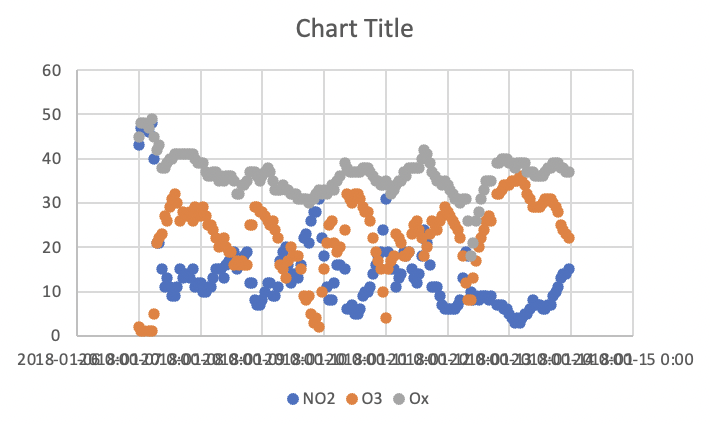
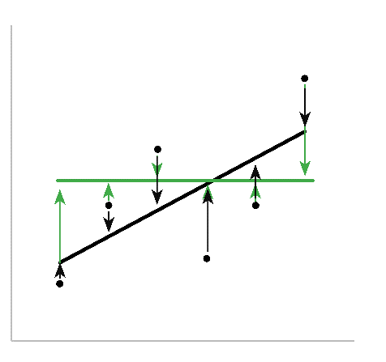

# Data Visualization 

Visualizing data is one of the most powerful ways to explore relationships and trends between variables. Visualizations are also a powerful way to communicate these relationships. In this section we will discuss the creation of the most common type of plot in chemistry: the scatterplot. How to make changes to a plot, how to add and format axes labels and how to add trendlines. 

## Creating a Scatterplot

Data collected in a chemistry lab is typically discrete, meaning each point is an individual measurement. With this in mind, the most common type of plot used to explore data in the chemistry lab is a scatterplot, which plots each data point independently on the grid space of the graph. To create a scatterplot, select the columns of data you want to visualize and then go to the INSERT ribbon and select CHARTS, then SCATTER, then SCATTER again (this selection may look like a button with a picture of a little scatterplot). Alternatively, you can select the INSERT tab, then CHARTS, then X Y (Scatter). 

```{r}
knitr::include_graphics(path="./gifs/CreateScatter.gif")
```

If you would like to make a plot with more than 1 dataset included, as in the gif above, then you can select all of the columns in question and create the scatterplot as described. Note that, as shown in the gif above, you can select an entire column by clicking on the column heading (e.g. clicking on ‘A’ will select all the data in column ‘A’). If you need to select columns that are not directly adjacent to one another hold the CTRL button (or COMMAND on a Mac) and click on the column headings you wish to select.  

The first thing to do once you make a plot is to simply look at it. Are the correct values plotted on the correct axes? Are the values properly formatted?  Here is the plot that resulted from the gif above. What do you think?



Although this figure is a bit difficult to read, from the flow of the points it looks as though the date and time is plotted on the x-axis and concentration on the y-axis. If you haven't removed any -999 values in your dataset you might see some outlier values. If this is the case the [Data Manipulation] section walks you through how to remove them.  

## Changing Chart Type or Design

As mentioned above, scatterplots are the most common type of plot in the chemistry lab as the data collected is discrete. However, as is often the case, rules were meant to be broken and although the timeseries data is discrete, adding a continuous smooth line will make relationships between the variables much easier to visualize, so let's go ahead and do that. In addition to making the timeseries plot clearer, adding a smooth line will also allow us to practice changing a chart type after a plot has been generated. To do this click on the plot, then select the CHART DESIGN ribbon, then CHANGE CHART TYPE, then X Y (Scatter), then SCATTER WITH SMOOTH LINES (note that the last menu often appears as pictures of plots and so choose the one with a smooth line). This is also the menu you would choose if you wanted to change the chart type to visualize your data in another way (e.g. bar chart).

```{r}
knitr::include_graphics(path="./gifs/SmoothLine.gif")
```

## Adding Axis Labels and a Chart Title

Once you have confirmed your graph is appropriate you will need to add axes titles. To do this, click on the plot, then click on the CHART DESIGN ribbon, then ADD CHART ELEMENT, then AXIS TITLES and add titles to both the x-axis (PRIMARY HORIZONTAL) and y-axis (PRIMARY VERTICAL). Once the axes titles are present, you can edit them to an appropriate label and remember to include units if relevant.  

```{r}
knitr::include_graphics(path="./gifs/Axes.gif")
```

A chart title is typically added automatically, but if not, the ADD CHART ELEMENT menu is also where you can find the CHART TITLE menu. Once the title is present you can edit it. Note that the addition of subscript or superscript text to an Excel chart title or axis label will require that you select the text in question, right click on it, select *Font...*, and then select the change you want.

```{r}
knitr::include_graphics(path="./gifs/Title.gif")
```

## Formatting Axis Labels

Looking at the graph we are building in this section it is obvious that the x-axis is not properly formatted.  To format an axis (in this case the x-axis), double click the axis values to reveal the FORMAT AXIS option panel that includes two tabs AXIS OPTIONS and TEXT OPTIONS. Here you have many options to explore. The dates on the x-axis of this timeseries are about as complicated as you will encounter where a simple adjustment of font size is not enough. There are two ways to approach adjusting the date and time displayed on the x-axis:  adjust the spacing of the major and minor units within the AXIS OPTIONS tab; or adjust how the text is displayed in the TEXT OPTIONS tab. We will explore both options here.

The major and minor units of the x-axis can be adjusted in the AXIS OPTIONS tab of the FORMAT AXIS panel.  In the plot we are working on, the major unit was set to 1 (meaning every day is displayed) and the minor unit to 0.2. In this case the major unit corresponds to a gridline and a value displayed on the x-axis, while the minor unit is not displayed. Try changing these to something larger so that the date values are more spaced out. In the gif below the major unit was changed 2 and then to 3 and minor unit to 1. One of the consequences of changing the major and minor units of the x-axis is that it may change the bounds of the plot.  To adjust this, the MINIMUM and MAXIMUM values of the axis can be adjusted in the BOUNDS menu of the AXIS OPTIONS tab to reflect the 7 days in your dataset. Remember that Excel stores date and time values using numerical values (see the [Data Wrangling] section for more details). To adjust the bounds, add or subtract integer values (i.e. 1, 2, 3) to the minimum and maximum until your data is properly framed. Notice how changes made in the MINIMUM and MAXIMUM values of the axis update as soon as you click elsewhere, this is useful when playing around to find the proper framing for the data.

```{r}
knitr::include_graphics(path="./gifs/AxisFormatting.gif")
```

To adjust the x-axis by changing the direction of the text, select the TEXT OPTIONS tab of the FORMAT AXIS panel, find the TEXT BOX options box and change the angle of the text either by selecting an option such as ROTATED 90^o^ from the TEXT DIRECTION menu or changing the value in the CUSTOM ANGLE box. One final note about axis formatting is that you may want to change how the values themselves are formatted (for example you may only want to see the date values and not the time in your timeseries). Remember that the values displayed in the graph are tied to specific values in your Excel sheet, and so any adjustments made to the values in the sheet will be reflected in the graph. 

```{r}
knitr::include_graphics(path="./gifs/AxisFormatting2.gif")
```

## Adding a Data Series to an Existing Plot

In the example above all of the data is ready to plot, but that's not always the case. If we pretend that the plot was made before the O~X~ values were calculated we can then add them in after the fact. In the gif below the O~X~ data series is deleted and then re-added. To add data to a plot right click on the plot and click SELECT DATA from the dropdown menu (or go to the CHART DESIGN ribbon and click SELECT DATA). In the SELECT DATA SOURCE dialog box you should see the two data series already on your plot for NO~2~ and O~3~. Directly above this list, click ADD (on Mac select “+” directly below the list) and the EDIT SERIES dialog box will open, which includes three boxes entitled SERIES NAME:, SERIES X VALUES: and SERIES Y VALUES: (on Mac no new dialog box will open, but a data series will be added to the list and the boxes NAME:, X VALUES: and Y VALUES: will become available). To input information into these three boxes you can type directly into the box or click the arrow (on Mac this looks more like a little Excel sheet) to select data from your Excel sheet. The SERIES NAME: box is what your dataset will be referred to in the chart legend. You can type “Ox” directly in the box, or you can select the column header (the latter may be preferable as any changes to the table header will be applied immediately to the plot). To select data for the OX series, click on the arrows next to the SERIES X VALUES: and SERIES Y VALUES: and input the relevant data.  For the x-values select the Data & Time data and for the y-values select the calculate O~X~ values (don’t include the headers). 

```{r}
knitr::include_graphics(path="./gifs/AddSeries.gif")
```

## Linear Regression

To explore the relationship between O~3~ and NO~2~ you can create a correlation plot, which is a plot of one variable versus another, in this case O~3~ versus NO~2~. A robust statistical analysis of the correlation between O~3~ and NO~2~ is beyond the purview of this course. However, the correlation plot will help us better visualize the relationship between the two variables, which will improve our understanding of the factors affecting urban air quality and the chemistry taking place.

First, create a scatter plot as described above, but this time the x-axis will correspond to the concentration of NO~2~ and the y-axis to the concentration O~3~. Then to assess if there is any correlation between the two pollutants, we’ll perform a *linear least squares regression* analysis. *Linear* refers to the fact that the relationship can be expressed as a straight line defined by the equation y = mx + b. *Least squares* means that the trendline is the best approximation of the given dataset, while still being a straight line. Lastly, the term *regression* means we’re going to estimate the relationship between two variables.

Excel calculates the linear least squares regression trendline by minimizing the vertical distance (squares) between every actual value and its predicted value on the trendline. For example, in the figure below, the two lines (black and green) are both linear, but the black line is a better trendline as the sum of the squared distances between the points (the length of the arrows) is less than the green line. It’s important to remember that the ideal trendline may be farther from individual points than others (it might not touch any points at all), but the summed distance is the shortest.



## Adding a Trendling

To perform a linear regression analysis on your correlation plot between NO~2~ and O~3~, you will need to include a linear trendline. To do this right click on any of the data points in your plot and select ADD TRENDLINE from the dropdown menu. In the FORMAT TRENDLINE panel select LINEAR trendline, and then select DISPLAY EQUATION ON CHART and DISPLAY R-SQUARED VALUE ON CHART. Your plot should now resemble Figure 8 (but obviously with different data, as the data in this plot is from Tyler Vigen's collection of [spurious Correlations](https://www.tylervigen.com/spurious-correlations)). 

```{r}
knitr::include_graphics(path="./gifs/Regression.gif")
```

The R^2^ value of the linear regression is a measure of how well the line predicts the variation observed in the data, and it can be summarized by equation 10.

add equation

The closer R^2^ is to 1, the better the regression line describes the relationship between the two variables (aka the closer the line is to every plotted point). Another way to think of it is if R^2^ = 1, 100% of the variation is explained by the linear model. The R^2^ of a trendline is a useful value, but it is only describing the variance in the data, and so a higher R^2^ does not prove the correlation between two variables just as a low R^2^ does not disprove it.

The data shown in the gif above has a positive relationship. Between the years 2000 and 2009, the number of computer science PhDs graduating in the United States increased and so did the revenues from arcades. This is a positive correlation as the two variables increase or decrease together. This is evident visually and in the positive value of the slope of the trendline. Variables are negatively correlated when one increases the other decreases, in which case the slope of the trendline would be negative.

Does the observed correlation between arcade revenues and computer sciences PhDs mean one variable caused the other (causation)? Maybe, maybe not. It’s not possible to answer this question using this plot alone, but the correlation observed between the two variables suggests the relationship may warrant further investigation.
